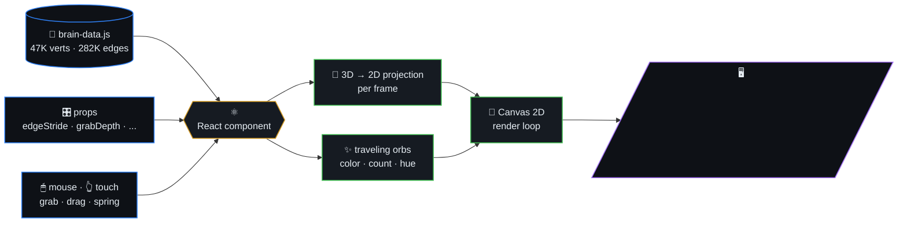
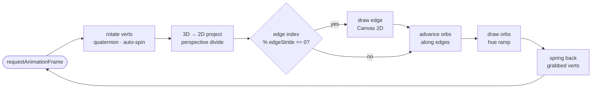
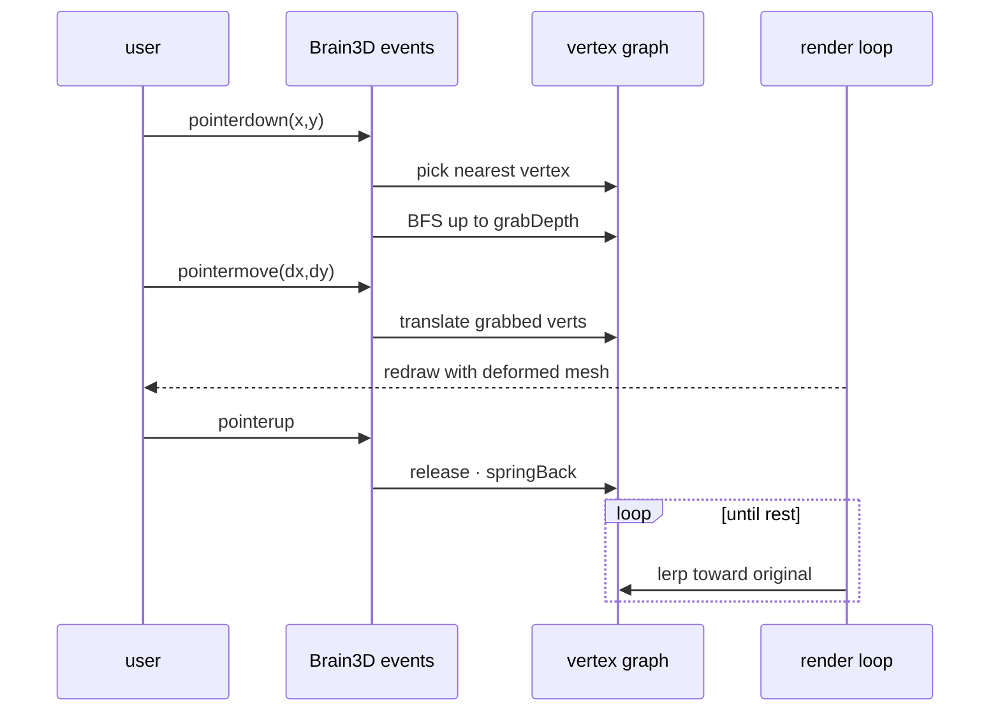

# brain-3d

> Interactive 3D brain wireframe rendered with pure **Canvas 2D** — no
> Three.js, no WebGL. 47K vertices, 282K edges, traveling electric orbs,
> click-and-drag mesh deformation. Touch-friendly. Fully configurable
> via props.



## Table of contents

- [Install](#install)
- [Render loop (algorithm)](#render-loop-algorithm)
- [Drag interaction (sequence)](#drag-interaction-sequence)
- [Usage (React / Next.js)](#usage-react--nextjs)
- [Key Props](#key-props)
- [Docs](#docs)
- [License](#license)
- [Files](#files)

## Render loop (algorithm)



## Drag interaction (sequence)



## Install

```bash
git clone git@github.com:ml-lubich/brain-3d.git
cd brain-3d/app
bun install   # or npm install
bun dev       # → http://localhost:3000
```

## Usage (React / Next.js)

```tsx
import { Brain3D } from "@/components/Brain3D"

// Defaults — just works
<Brain3D />

// Responsive, fewer edges for mobile
<Brain3D responsive edgeStride={3} orbCount={30} />

// Custom look
<Brain3D
  wireColor="rgba(150,50,255,0.15)"
  bgColor="#0a0014"
  orbHueMin={15}
  orbHueMax={40}
  grabDepth={6}
  springBack={0.005}
/>
```

Copy `public/brain-data.js` into your project's static assets.
Import `Brain3D` from `src/components/Brain3D.tsx`.

## Key Props

| Prop | Default | What it does |
|------|---------|-------------|
| `responsive` | `false` | Fill parent container, auto-resize |
| `edgeStride` | `1` | Render every Nth edge (performance) |
| `orbCount` | `90` | Number of traveling orbs |
| `grabDepth` | `4` | Hops of vertices grabbed when pulling |
| `springBack` | `0.012` | How fast mesh snaps back |
| `wireColor` | `rgba(0,170,255,0.13)` | Wireframe colour |
| `showControls` | `true` | Toggle buttons for rotation & orbs |

Full prop reference: [docs/configuration.md](docs/configuration.md)

## Docs

- [Architecture](docs/architecture.md) — how the renderer works
- [Configuration](docs/configuration.md) — all props, defaults, recipes

## License

[MIT](LICENSE)

## Files

- `brain-3d.js` — data + renderer (single file, importable)
- `index.html` — minimal demo
